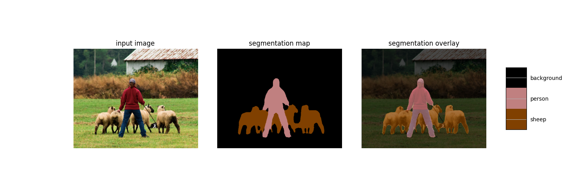

# SemanticSegmentation
This is a skill assesment task by Soundmap.io for the role of Software Intern.
This is an Tensorflow implementation of DeepLab v3  with a Xception backbone

## Setup

### Requirements

* Required Python packages are listed in the Anaconda configuration file `environment.yaml`.
* Clone this environment 'https://github.com/BhagyarajDharmana/SemanticSegmentation.git'

### Information about Task_1 
 
* The pretrained model was downloaded from http://download.tensorflow.org/models/deeplabv3_pascal_trainval_2018_01_04.tar.gz
* The input image was sent to the model and the model will send segmentation map and the resized image
* This is plotted using matplotlib and the output image is returned.

### Information about task_2
* An API was created using Flask app
* In the `templates` folder of the repository you can find html files of the API
* Run the `main.py` and go to http://127.0.0.1:5000/ and see the user information and upload an image and click submit.
* The output image will be appeared on the screen.

### Example of results is shown below.

